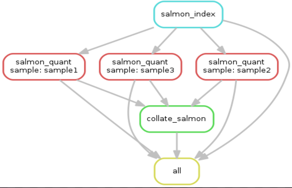

### Minimal working RNAseq pipeline using salmon and snakemake

I copied many codes from https://github.com/slowkow/snakefiles

To creat the `samples.json` file, feed the script with the full path to the fastq directory:

```bash
# conda environment
source activate snakemake

python3 write_sample2_json.py --fastq_dir ~/git_repos/RNA-seq-analysis/RNA-seq-snakemake-pipeline/myfastqs
````

```bash
#dry run
snakemake -np

## work flow diagram
snakemake --forceall --dag | dot -Tpng | display
```




Fold structure for the fastq files is like this:

```
myfastqs/
├── sample1
│   ├── sample1_R1.fastq.gz
│   └── sample1_R2.fastq.gz
├── sample2
│   ├── sample2_R1.fastq.gz
│   └── sample2_R2.fastq.gz
└── sample3
    ├── sample3_R1.fastq.gz
    └── sample3_R2.fastq.gz

```
